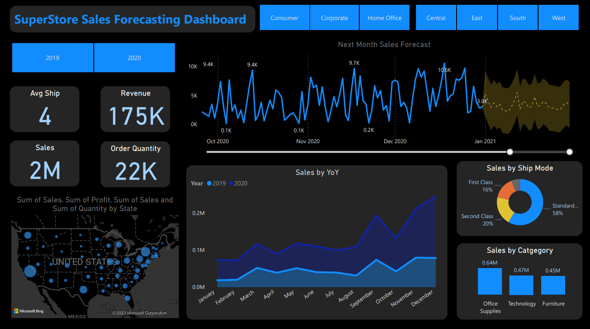

# SuperStore Sales Dashboard with Live Forecasting

## Overview
The "SuperStore Sales Dashboard with Live Forecasting" is a data analytics and visualization project aimed at providing valuable insights and accurate sales forecasting to support the growth and efficiency of a supermarket. This project combines data analysis techniques, interactive dashboard design, and time series analysis to empower decision-makers with actionable information.

## Table of Contents

- [Objective](#objective)
- [Dashboard/Forecast Preview](#dashboard-preview)
- [Features](#features)
- [data Analysis](#data-analysis)
- [sales Forecasting](#sales-forecasting)
- [Data Sources](#data-sources)
- [How to Use](#how-to-use)
- [Contributing](#contributing)
- [License](#license)

## Objective
The primary objective of this project is to contribute to the success of a business by utilizing data analysis techniques, with a focus on time series analysis, to provide valuable insights and accurate sales forecasting. This SuperStore Sales Dashboard has been developed to empower decision-makers with actionable insights, ultimately supporting the supermarket's goals for growth, efficiency, and customer satisfaction.

## Dashboard Preview



<p><a href="https://app.powerbi.com/links/3T9wF50axZ?ctid=63b5c61a-66d9-46b2-9b8d-10c275a4acac&pbi_source=linkShare">Click Here</a> to view the published interactive dashboard.</a></p>

### Features
- **Identify KPIs:** Identifying the key performance indicators (KPIs) that are essential for understanding and optimizing the sales performance and growth of the supermarket.
- **Intuitive Design:** Design of an intuitive and visually appealing dashboard that allows users to easily grasp the essential sales metrics and trends.
- **Interactive Visualization:** The dashboard includes interactive visualizations and filtering capabilities, enabling users to explore data at various levels of granularity, make comparisons, and gain a deeper understanding of sales trends.
- **Strategic Decision-Making:** The end goal is to share valuable insights and actionable information that can drive strategic decision-making. These insights are aimed at helping the supermarket make informed choices to enhance growth, improve efficiency, and increase customer satisfaction.
- **Recommendations:** Provide with recommendations based on data analysis and forecasting results with a 95% confidence interval. These recommendations are tailored to address specific areas of improvement and opportunities for optimizing sales performance and increase revenue.

### Data Analysis
- **Valuable Insights:** Through data analysis, we provide valuable insights to business entities regarding the effectiveness of their sales strategies. Use visualization and charts to present this information in a clear and comprehensible manner.
- **Sales Strategies Assessment:** We assess the impact of various sales strategies and identify areas where improvements can be made to boost sales performance.

### Sales Forecasting
- **Time Series Analysis:** Leveraging historical data, we apply time series analysis techniques to generate accurate sales forecasts for the next 30 days with a 95% confidence interval. This forecasting helps in planning inventory, staffing, and resources efficiently.


## Data Sources
The data for this dashboard is sourced through online data sources i.e superstore sales data and few data transformations are done for the data integrity.
<a href="dataset/">click here</a> to check the data sources.

## How to Use
To explore the SuperStore Sales Dashboard and access live sales forecasting, follow these steps:

1. **Clone the Repository:** Clone this repository to your local machine.
```bash
git clone https://github.com/bharathguntreddi3/SuperStore_Sales_Forecasting.git
```

2. **Run the Dashboard:** Execute the dashboard application by running the main script. Ensure you have the required/downloaded data source configured.

3. **Explore and Analyze:** Use the interactive dashboard to explore sales data, view insights, and access live sales forecasts.

open the sales_forecasting.pbix file in PowerBI desktop and refresh the data to get the latest data.

## Contributing

If you'd like to contribute to this project, please follow these guidelines:

- Fork the repository.

- Create a new branch for your feature or bug fix.

- Make your changes and ensure they work as expected.

- Create a pull request with a clear description of your changes.

- creative pull request will be reviewed and merged if appropriate.

## License

This project is licensed under the [MIT License](LICENSE). Feel free to use, modify, and distribute the code as per the terms of the license.

I hope this repository helps you gain valuable insights from your sales data using SQL and RFM analysis. If you have any questions or need further assistance, please feel free to open an issue. Happy analyzing!

If you find this project interesting and useful, show your support by starring ⭐ the repository and sharing it with others. Let's revolutionize productivity together!

## If any necessary commits are required to increase the elegance of this repo! i'm always open for a PR.

## With this signing off..!!, BHARATH GUNTREDDI ..🤞
